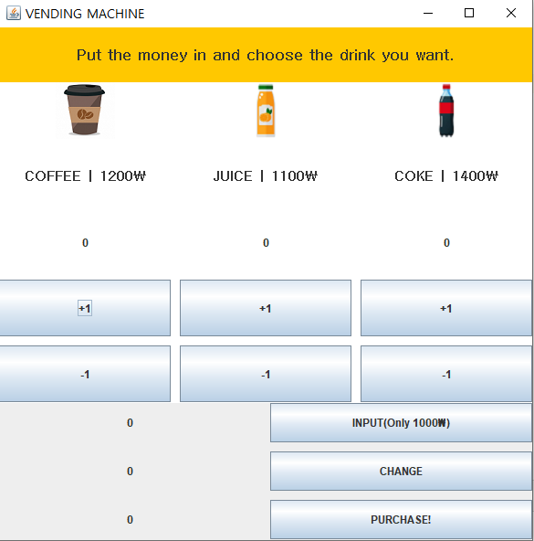

# COFFEE MACHINE

-----------------

+ 자판기의 기능을 살리는 기초적인 틀의 공사부터 시작했다.

+ 각자 틀을 만들어보고 공부를 한 뒤 내부 실행 코드를 짜도록 했다.

+ 여러가지 기능들을 넣고 그림을 넣고 하니 오히려 복잡하고 이해 안되는 느낌이 들어서 실제 자판기처럼 간단하고 이해가 쉬운 기계를 만드는데에 초점을 두려 노력했다.

-------------------------------------------------


### 기초공사


1. 메인 클래스를 만들어서 확인할 수 있도록 하였다.

```
public class M
{
    public static void main(String[] args)
    {
        Machine m = new Machine();
    }
}
```

2. 자판기 기능을 할 수 있는 버튼과 나타나야하는 내용을 정리했다.

   ```
   private JLabel title1 = new JLabel("Put the money in and choose the drink you want.");
   
    private JButton btnEnd = new JButton("Your purchase has been completed!");
    ImageIcon b1 = new ImageIcon("images/coffee.png");
    JLabel imagelabel1 = new JLabel(b1);
    ImageIcon b2 = new ImageIcon("images/juice.png");
    JLabel imagelabel2 = new JLabel(b2);
    ImageIcon b3 = new ImageIcon("images/coka.png");
    JLabel imagelabel3 = new JLabel(b3);
   
    private JLabel name1 = new JLabel("COFFEE | 1200₩");
    private JLabel name2 = new JLabel("JUICE | 1100₩");
    private JLabel name3 = new JLabel("COKE | 1400₩");
   
    private JLabel l1 = new JLabel("0");
    private JButton bu1 = new JButton("+1");
    private JButton bu4 = new JButton("-1");
   
    private JLabel l2 = new JLabel("0");
    private JButton bu2 = new JButton("+1");
    private JButton bu5 = new JButton("-1");
   
    private JLabel l3 = new JLabel("0");
    private JButton bu3 = new JButton("+1");
    private JButton bu6 = new JButton("-1");
   
    private JLabel s3 = new JLabel("0");
    private JButton ss3 = new JButton("INPUT(Only 1000₩)");
   
    private JLabel s4 = new JLabel("0");
    private JButton ss4 = new JButton("CHANGE");
   
    private JLabel s2 = new JLabel("0");
    private JButton ss2 = new JButton("PURCHASE!");
   ```

3. 허전한 듯 하여서 창 설명도 추가해보았다.

```
public Machine()
{
    super("COFFEE MACHINE");

    init();
    start();
}
```

+ ```창의 사이즈 설정
  this.setSize(600, 600);
  ```


--------------------------------------

### 자리정리

+ ```글씨 크기 정하기
  title1.setFont(new Font("굴림", Font.BOLD, 17));
  ```

+ ```자리 정리를 할 때 묶기 위함
  private JPanel j7 = new JPanel(new GridLayout(0, 2, 5, 0));
  ```

+ ```중앙 정렬
  title1.setHorizontalAlignment(title1.CENTER);
  ```

1. 창의 위쪽 부분을 정리한다.

   ```
   j1.add(title1);
   
   this.add("North", j1);
   
   j1.setBackground(Color.ORANGE);
   
   ```

2. 창의 센터 부분을 정리한다.

```
this.add("Center", j5);
j5.add(imagelabel1);
j5.add(imagelabel2);
j5.add(imagelabel3);
j5.add(name1);
j5.add(name2);
j5.add(name3);
j5.add(l1);
j5.add(l2);
j5.add(l3);
j5.add(bu1);
j5.add(bu2);
j5.add(bu3);
j5.add(bu4);
j5.add(bu5);
j5.add(bu6);
j5.setBackground(Color.WHITE);
```

3. 창의 아래쪽 부분을 정리한다.

```
j7.add(s3);
j7.add(ss3);

j7.add(s4);
j7.add(ss4);


j7.add(s2);
j7.add(ss2);
this.add("South", j7);
```

4. 자리별 사이즈 정하였다.

   ```
   j1.setPreferredSize(new Dimension(70, 70));
   j5.setPreferredSize(new Dimension(380, 380));
   j7.setPreferredSize(new Dimension(150, 150));
   ```

-----------------------------------------

### 버튼 클릭

1. 버튼을 클릭할 때 변화를 시작한다.

```
public void start() {
    bu1.addMouseListener(this);
    bu2.addMouseListener(this);
    bu3.addMouseListener(this);
    bu4.addMouseListener(this);
    bu5.addMouseListener(this);
    bu6.addMouseListener(this);
    ss3.addMouseListener(this);
}
```

2. 버튼 내부 코드를 짜보았다.

   ```
   public void mouseClicked(MouseEvent e) {
       int val = 0;
       int input = 0;
       int sub = 0;
   
       if (e.getSource() == (JButton) bu1) {
           val = Integer.parseInt(s2.getText());
           val += 1200;
           this.Num1 = this.Num1 + 1;
           sub = Integer.parseInt(s4.getText());
           sub -= 1200;
   
           l1.setText(String.valueOf(Num1));
           s2.setText(String.valueOf(val));
           s4.setText(String.valueOf(sub));
       } else if (e.getSource() == (JButton) bu4) {
           val = Integer.parseInt(s2.getText());
           val -= 1200;
           this.Num1 = this.Num1 - 1;
           sub = Integer.parseInt(s4.getText());
           sub += 1200;
   
           l1.setText(String.valueOf(Num1));
           s2.setText(String.valueOf(val));
           s4.setText(String.valueOf(sub));
       } else if (e.getSource() == (JButton) bu2) {
           val = Integer.parseInt(s2.getText());
           val += 1100;
           this.Num2 = this.Num2 + 1;
           sub = Integer.parseInt(s4.getText());
           sub -= 1100;
           s4.setText(String.valueOf(sub));
           l2.setText(String.valueOf(Num2));
           s2.setText(String.valueOf(val));
       } else if (e.getSource() == (JButton) bu5) {
           val = Integer.parseInt(s2.getText());
           val -= 1100;
           this.Num2 = this.Num2 - 1;
           sub = Integer.parseInt(s4.getText());
           sub += 1100;
   
           l2.setText(String.valueOf(Num2));
           s2.setText(String.valueOf(val));
           s4.setText(String.valueOf(sub));
       } else if (e.getSource() == (JButton) bu3) {
           val = Integer.parseInt(s2.getText());
           val += 1400;
           this.Num3 = this.Num3 + 1;
           sub = Integer.parseInt(s4.getText());
           sub -= 1400;
           s4.setText(String.valueOf(sub));
           l3.setText(String.valueOf(Num3));
           s2.setText(String.valueOf(val));
       } else if (e.getSource() == (JButton) bu6) {
           val = Integer.parseInt(s2.getText());
           val -= 1400;
           this.Num3 = this.Num3 - 1;
           sub = Integer.parseInt(s4.getText());
           sub += 1400;
           s4.setText(String.valueOf(sub));
           l3.setText(String.valueOf(Num3));
           s2.setText(String.valueOf(val));
   
       }
       else if (e.getSource() == (JButton) ss2) {
           s2.setText("0");
   
       }
       else if(e.getSource() == ss3){
           input = Integer.parseInt(s3.getText());
           input += 1000;
   
           sub = Integer.parseInt(s4.getText());
           sub += 1000;
           s4.setText(String.valueOf(sub));
           s3.setText(String.valueOf(input));
   
       }
   
   
   }
   ```

-------------------------------

### 결과창 표시

+ 버튼 ss2가 눌렸을 경우 endPage패널 외에는 보이지 않게 설정 하였다.

```
ss2.addActionListener(new ActionListener() {

    @Override
    public void actionPerformed(ActionEvent e) {
        getContentPane().add(endPage, BorderLayout.CENTER);
        endPage.setVisible(true);
        j1.setVisible(false);
        j5.setVisible(false);
        j7.setVisible(false);
    }

});
```

----------------------------------
### 시스템 종료
+ 버튼 btnEnd가 눌렸을 경우 실행되는 시스템이 종료 되도록 하였다.
```
btnEnd.addActionListener(new ActionListener() {

            @Override
            public void actionPerformed(ActionEvent e) {
                System.exit(0);
            }

        });

```

----------------------------------
#### JAVA API

```
import java.awt.BorderLayout;
import java.awt.Dimension;
import java.awt.FlowLayout;
import java.awt.Font;
import java.awt.GridLayout;
import java.awt.event.ActionEvent;
import java.awt.event.ActionListener;
import java.awt.event.MouseEvent;
import java.awt.event.MouseListener;

import javax.swing.BorderFactory;
import javax.swing.ImageIcon;
import javax.swing.JButton;
import javax.swing.JFrame;
import javax.swing.JLabel;
import javax.swing.JPanel;
import java.awt.Color;
```

------------------------------

## 결과창


